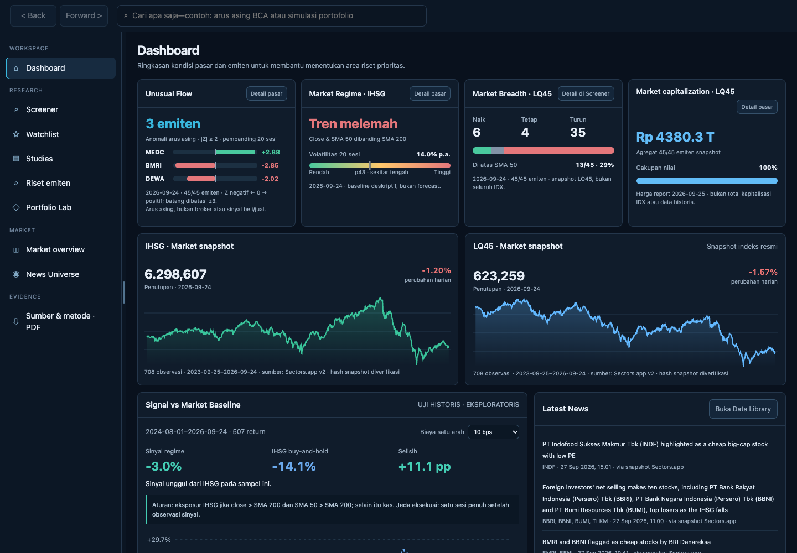
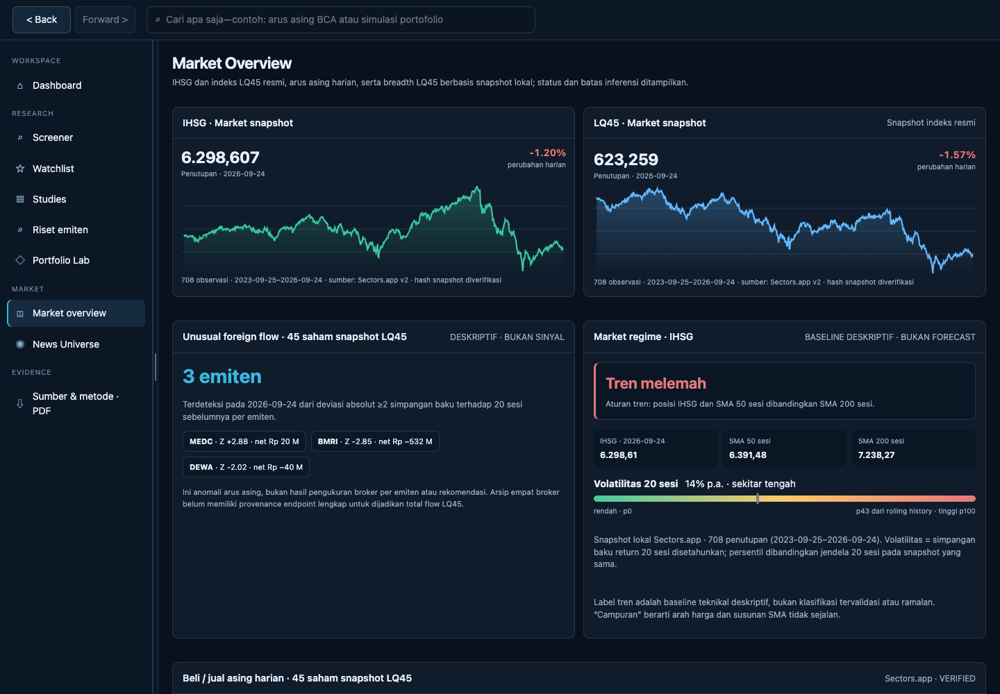
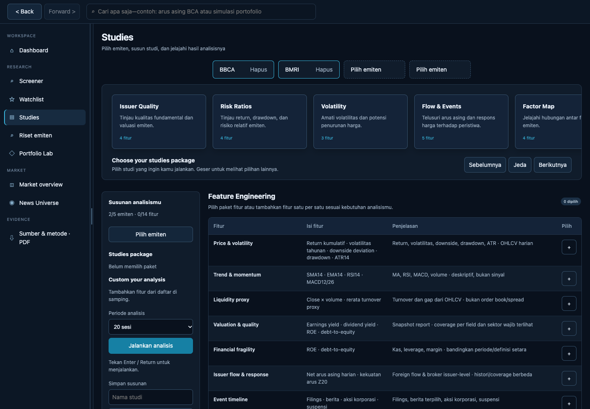
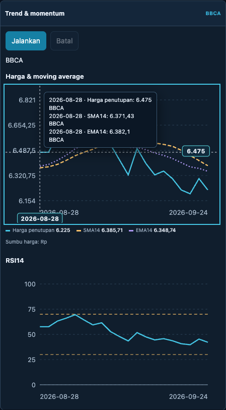
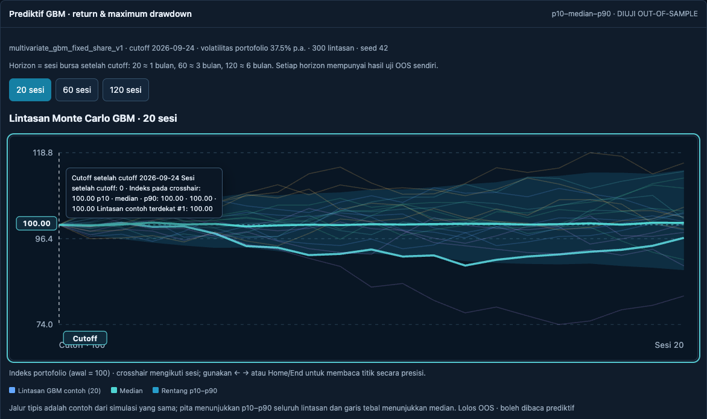
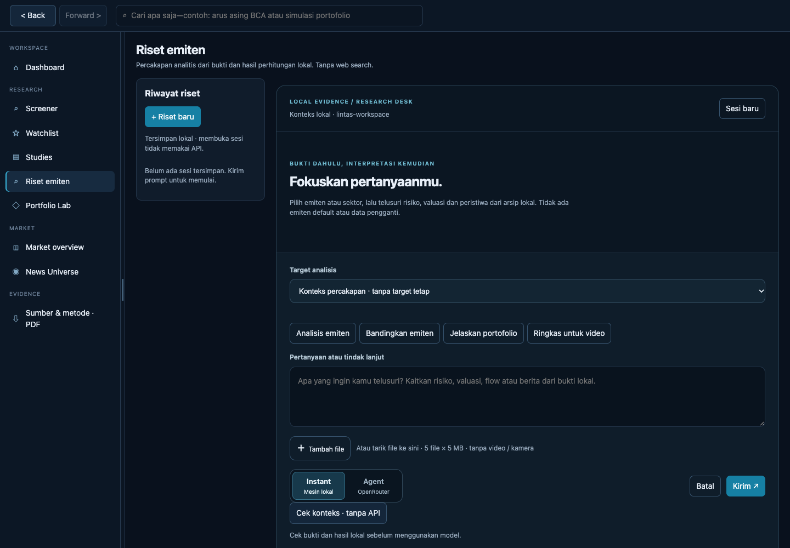

# IDX Evidence Lab

An evidence-first research prototype for Indonesian equities, built for the Sectors Hackathon Track 03: Market Intelligence. Explore issuers, market context, historical events, portfolio risk, and research evidence in one local web application.

> **Data and deployment notice:** The application reads market snapshots included in this repository. Starting the server does not fetch fresh Sectors data. This is not a live market feed, an order-execution system, or investment advice. The app has no authentication; keep it on a trusted machine and do not expose it to the public internet.



The screenshots below are illustrative snapshots of the local prototype, captured on 8 October 2026. Dates shown inside charts refer to the underlying snapshot, not the screenshot date. UI details can differ between commits.

## Contents

- [Run locally](#run-locally)
- [Workspaces](#workspaces)
- [Studies](#studies)
- [Portfolio Lab and Monte Carlo GBM](#portfolio-lab-and-monte-carlo-gbm)
- [Issuer research and OpenRouter](#issuer-research-and-openrouter)
- [Performance evidence and mock example](#performance-evidence-and-mock-example)
- [Repository layout and notebooks](#repository-layout-and-notebooks)
- [Testing and limitations](#testing-and-limitations)

## Run locally

### Requirements

- Git and Python 3.10 or newer.
- Safari, Chrome, or Edge.
- Internet access to clone the repository and install Python packages. Snapshot-based analysis does not require an API key.
- Keep the terminal open while the server is running.

The current application is served by the Python backend and legacy HTML/CSS/JavaScript UI. Node.js, npm, MATLAB, a GPU, and an OpenRouter key are not required to run the core website. The separate frontend React workspace is an early development shell and is not the default application UI.

### macOS

Open Terminal and run:

```bash
git clone https://github.com/rasyaaudreabramantyawijaya/IDX-Evidence-Lab.git
cd IDX-Evidence-Lab

python3 -m venv .venv
source .venv/bin/activate
python3 -m pip install --upgrade pip
python3 -m pip install -r requirements-portfolio.txt

PYTHONPATH=src python3 -m idx_evidence_lab.web_app
```

Open http://127.0.0.1:5500. Stop the server with Control+C. To start it again, return to the repository root, activate the virtual environment, and rerun the final command.

### Windows (PowerShell)

Install Git and Python 3.10 or newer. In PowerShell:

```powershell
git clone https://github.com/rasyaaudreabramantyawijaya/IDX-Evidence-Lab.git
cd IDX-Evidence-Lab

py -3 -m venv .venv
.\.venv\Scripts\python.exe -m pip install --upgrade pip
.\.venv\Scripts\python.exe -m pip install -r requirements-portfolio.txt

$env:PYTHONPATH = "src"
.\.venv\Scripts\python.exe -m idx_evidence_lab.web_app
```

Open http://127.0.0.1:5500 in Edge or Chrome. Stop the server with Ctrl+C. If the py launcher is unavailable but python reports a supported version, replace py -3 -m venv .venv with python -m venv .venv. Run commands from the repository root.

**Windows note:** These PowerShell instructions follow the repository structure but have not been verified on a physical Windows machine.

### Optional: VS Code Live Server

To use the Live Server extension, start the API sidecar on port 5501, then start **Go Live**:

1. Open the repository root in VS Code.
2. Run the task **IDX Evidence Lab: Local API (5501)**, or start the backend manually.
   - macOS: IDXEL_PORT=5501 PYTHONPATH=src python3 -m idx_evidence_lab.web_app
   - PowerShell:

§§§powershell
$env:IDXEL_PORT = "5501"
$env:PYTHONPATH = "src"
.\.venv\Scripts\python.exe -m idx_evidence_lab.web_app
§§§

3. Open docs/prototypes/idx-evidence-lab-user-journey.html and choose **Go Live**.
4. Open http://127.0.0.1:5500/docs/prototypes/idx-evidence-lab-user-journey.html.

The VS Code settings proxy /api to http://127.0.0.1:5501/api. Do not run the standalone Python server on port 5500 at the same time as Live Server. Check http://127.0.0.1:5500/api/health; a successful health response confirms a local backend, not a successful OpenRouter request.

## Workspaces

| Workspace | Purpose |
|---|---|
| Dashboard | Market summary, market regime, LQ45 breadth, capitalization snapshot, index charts, and recent news. |
| Screener | Filter the local issuer universe and inspect historical event outcomes and issuer regimes. |
| Watchlist | Keep selected tickers in the current browser’s local storage. It is not synced across users or devices. |
| Studies | Compose allowlisted analytical panels for issuer, sector, or universe targets; inspect inputs, formulas, coverage, and outputs. |
| Issuer research | Ask questions using local evidence and calculations; optionally use OpenRouter to draft a validated response. |
| Portfolio Lab | Compare allocation methods, portfolio risk, historical walk-forward results, bootstrap scenarios, and GBM forecasts. |
| Market overview | Inspect IHSG/LQ45 snapshots, RSI and breadth, sector context, and available risk distributions. Panels without valid source inputs explicitly show that data is unavailable. |
| News Universe | Search and filter the locally bundled news archive. It is not a live news feed. |
| Issuer dossier | Review issuer overview, available price/flow history, evidence, and event context. |
| Sources and methods | Inspect data provenance, definitions, assumptions, and limitations; use the browser print dialog for PDF output. |

Dashboard cards link to related research areas. Historical events, flows, market breadth, and regime labels are descriptive context, not buy/sell recommendations. Some Market Overview panels, such as intraday metrics or calculations requiring unavailable inputs, are marked unavailable rather than inferred from unrelated data. Snapshot and issuer coverage can be partial.



### Search and charts

Global search helps navigate issuers, sectors, workspaces, features, and news. Natural-language interpretation may use the optional provider path; local navigation remains available when a model is not configured.

Charts with pointer interaction show a crosshair and tooltip for the nearest available date/session and value. Combined price charts can show close and moving-average series on the same time axis. Exact hover fields depend on the chart and available input data.

## Studies

Studies has **16 allowlisted analytical panels** and six preset layouts. Choose issuer, sector, or universe targets; select a supported lookback; add panels; and run them locally. It does not execute user-provided code or call an LLM to calculate results.



| Panel | What it examines |
|---|---|
| Price & volatility | Returns, realized volatility, downside deviation, drawdown, and ATR when input fields are available. |
| Trend & momentum | Moving averages, RSI, MACD, slopes, and related price/volume measures. |
| Liquidity proxy | Turnover and OHLCV-based liquidity/downside proxies; not order-book depth or spread. |
| Portfolio risk | Portfolio ratios and risk measures from a linked portfolio artifact when available. |
| Valuation & quality | Comparable valuation, profitability, growth, leverage, and company-report coverage. |
| Financial fragility | Cash, leverage, margins, profitability, and cash-flow direction when comparable report fields exist. |
| Issuer flow | Available issuer-level foreign-flow and price-response history; source coverage varies. |
| Event timeline | Available filings, news, corporate actions, and suspension history. |
| IHSG context & regime | Benchmark-relative returns, IHSG trend, and volatility context. |
| Market breadth | Advancers/decliners and shares above selected moving averages for the current snapshot universe. |
| CAPM benchmark | Historical beta and benchmark estimates using the supplied risk-free assumption. |
| Factor characteristics | Descriptive value, quality, momentum, and low-volatility characteristics; not a Fama–French model. |
| Compare issuers | Compare like-for-like fields, periods, and coverage. |
| Event outcomes | Historical forward outcomes and related event metrics where the sample is sufficient. |
| Custom engineering | Allowlisted transforms such as differences, percentage changes, rolling mean/std, and robust z-score. No arbitrary code execution. |
| Evidence & methodology | Input IDs, coverage, source, formula/model version, and status where recorded. |

The six preset layouts are Volatility, Issuer Quality, Flow & Events, Risk Ratios, Factor Map, and Evidence Review. A preset arranges panels; it does not certify that data are complete or results are predictive.



## Portfolio Lab and Monte Carlo GBM

Portfolio Lab supports allocation methods, risk ratios, walk-forward comparisons, exploratory block-bootstrap paths, and a Geometric Brownian Motion forecast.

### GBM method

The forecast uses `multivariate_gbm_fixed_share_v1` in `src/idx_evidence_lab/portfolio/portfolio_scenarios.py`.

- It estimates daily multivariate log-return means and covariance from a trailing window (default 252 sessions), then simulates correlated asset paths.
- Initial portfolio weights are held as fixed shares, so portfolio weights may drift with prices.
- Default horizons are 20, 60, and 120 trading sessions. The UI requests 300 forward simulations with seed 42; the API function has its own defaults.
- The chart shows simulated paths, the median, and the p10–p90 range. Quantiles are descriptive unless the corresponding out-of-sample (OOS) status supports interpretation.
- OOS scoring uses rolling origins. Each fit uses only data available before that origin and compares realized cumulative return and maximum drawdown with simulated quantiles. It reports coverage, PIT, and pinball loss against a historical rolling-window baseline.
- The minimum effective fold count is 10. Overlapping horizons reduce the effective count, and folds may remain autocorrelated.

The model assumes constant drift/covariance and normally distributed log returns. It does not model regime shifts, fat tails, or dividends, and results are gross of costs. Return and drawdown validation statuses can differ. READY means the calculation ran; it does not by itself establish predictive reliability.



Block bootstrap is a separate exploratory scenario method, not the GBM forecast or a validated prediction interval.

## Issuer research and OpenRouter

Issuer research offers a local mode and an optional OpenRouter Agent mode.



- **Local mode** retrieves permitted local evidence and calculations without contacting an LLM.
- **Agent mode** sends the prompt and selected context to OpenRouter. The server validates the returned structure and cited numbers against available evidence; model output is not an independent source of market facts.
- API credentials stay on the server. Configure them locally with:

```bash
python3 scripts/configure_openrouter.py
```

The helper hides key input and writes .env.local, which is excluded from Git. Restart the backend after changing configuration. OPENROUTER_API_KEY is required; OPENROUTER_MODEL and OPENROUTER_FALLBACK_MODELS can select a primary model and fallbacks. Model availability and provider limits can change. A saved key or healthy local API does not prove that a provider request will succeed.

Research sessions are held in server memory, bounded by session/message limits, and expire. They are not durable history shared across users or server restarts. Review the context sent to the model and do not enter private material without authorization. Attachments may be unreadable; the local reader does not provide image OCR or vision.

## Performance evidence and mock example

### What is measured

- Automated tests cover calculations, API contracts, UI behavior, and offline provider/error handling. Fixtures and mocks do not measure live model quality or investment returns.
- The GBM engine includes an OOS evaluation path for return and maximum drawdown, using coverage, PIT, pinball loss, and a rolling-window baseline. Results depend on portfolio, cutoff, snapshot, and horizon.
- OOS status is horizon- and target-specific. INSUFFICIENT_OOS_FOLDS means the effective-fold threshold is not met. OOS_MISCALIBRATED indicates that observed coverage missed the nominal target by the engine’s tolerance. Other statuses distinguish calibration and relative baseline performance.
- The repository does not support a universal claim that the model “performs well.” Inspect the actual OOS diagnostics for the inputs you use.

### MOCK: presentation illustration only

**Every value below is fictional and is not a measured result.** This table is only a mock layout; it is not based on training, backtesting, OpenRouter output, or Portfolio Lab results.

| Illustrative metric | MOCK model | MOCK baseline | Interpretation |
|---|---:|---:|---|
| p10–p90 coverage | 80% | 75% | Fictional example near an 80% nominal target. |
| Pinball loss | 0.025 | 0.030 | Fictional example where the model loss is lower. |
| Effective folds | 12 | 12 | Fictional example above the minimum threshold. |

Use a caption such as: **“MOCK: illustrative evaluation layout; these figures are not benchmark results.”** Replace the mock with actual OOS diagnostics before presenting model performance as measured evidence.

## Repository layout and notebooks

```text
src/idx_evidence_lab/       Python server, evidence retrieval, analyses, provider adapters
docs/prototypes/           Current prototype UI, local snapshots, and issuer dossiers
docs/assets/readme/        Sanitized README screenshots
data/raw/sectors/          Bundled local market snapshots and metadata
configs/                   Runtime schemas and source policies
scripts/                   Startup, local provider setup, exports, and helpers
frontend/                  React/TypeScript development shell and legacy UI source chunks
tests/                     Calculation, API, UI, security, and offline provider tests
reports/                   Studies reference manifest and test artifacts
notebooks/                 Analysis and validation notebooks
fetch.ipynb                Legacy data-fetch notebook
```

The local website requires its prototype assets under docs/prototypes/. Market snapshots have finite coverage and an as-of date; running the server does not refresh them.

For notebook dependencies:

```bash
python3 -m pip install -r requirements-notebooks.txt
```

The Portfolio Lab export script can build a notebook bundle from available local snapshots without making a provider request:

```bash
python3 scripts/export_portfolio_lab_notebook_data.py
```

The generated bundle is local output and is not committed. Notebooks may require repository files and additional setup described in their own cells. Review any notebook before running it; some legacy notebooks can fetch data or execute training code.

## Testing and limitations

Run the Python tests from the repository root:

```bash
PYTHONPATH=src python3 -m pytest -q
```

For the React development workspace, see frontend/README.md. CI runs Python and frontend checks, a Docker smoke test, secret scanning, and dependency auditing. Browser end-to-end and container vulnerability checks have separate reporting/gating behavior; see the workflow files for the current configuration.

Known limitations:

- The application has no authentication or production identity/authorization layer. The default server binds to loopback; do not expose it directly to an untrusted network.
- Research sessions are ephemeral in-memory sessions; there is no Supabase-backed shared history in this branch.
- Bundled market data is a local snapshot, not a live feed. Review provider terms before redistributing it.
- Some dashboard or feature panels may report partial/unavailable data. Missing values are not zero.
- Historical index membership is not reconstructed; current-universe studies can have survivorship limitations.
- Financial and technical metrics are research context, not recommendations. Portfolio results can omit costs and distributions unless explicitly stated.
- Model output and OOS checks do not guarantee future performance.
